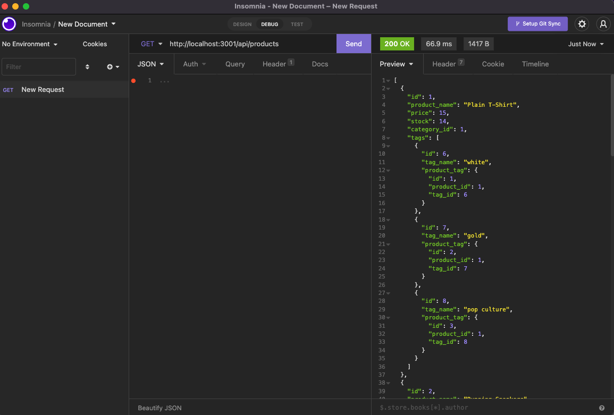

# E-Commerce Back End 

## License
   

   Please click on the badge to view license info.
   

## Description
This project is the back end for an e-commerce site.

## Table of Contents

- [License](#license)
- [Description](#description)
- [Installation](#installation)
- [Usage](#usage)
- [Visuals](#visuals)
- [Tests](#tests)
- [Contributors](#contributors)
- [Contact](#contact)

## Installation
In order to look at this project, please use npm install and node server.js.

## Usage
To provide backend functionality for an e-commerce store.

## Visuals

Please click the link below to be taken to a video walkthrough of the project. 

## Tests

None.

## Contributors

Sherreka S. Burton & Trilogy Starter Code

## Contact

If you have any questions about this project please contact: Sherreka S. Burton

Github: [ssbbgm](http://github.com/ssbbgm)

Email: ssburto825@gmail.com

